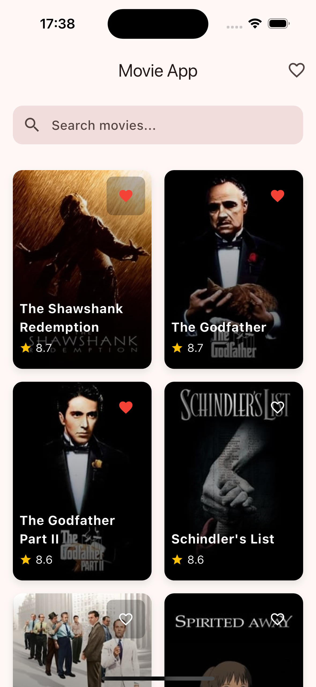
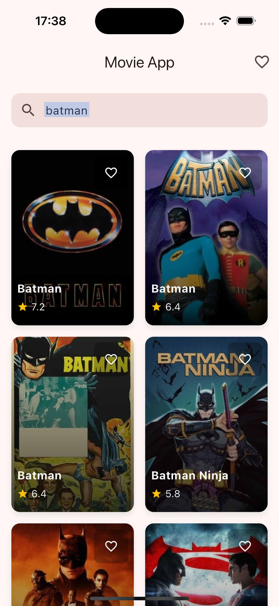
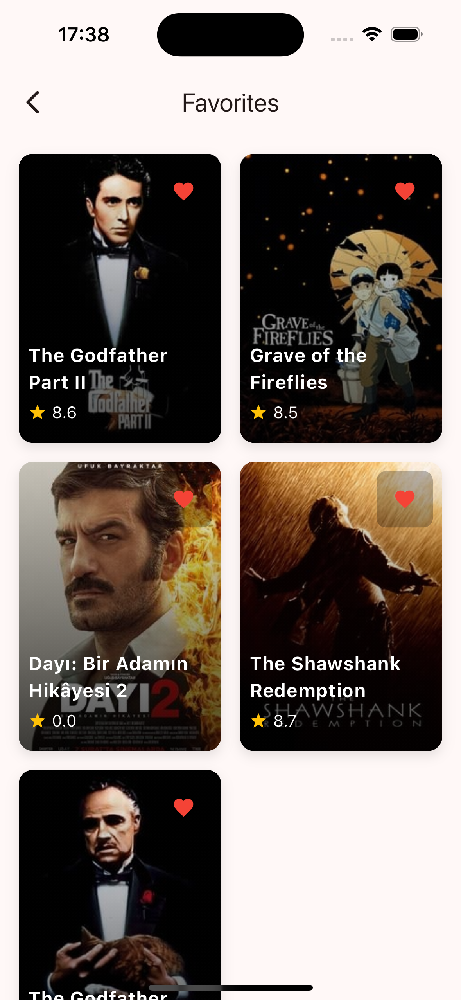
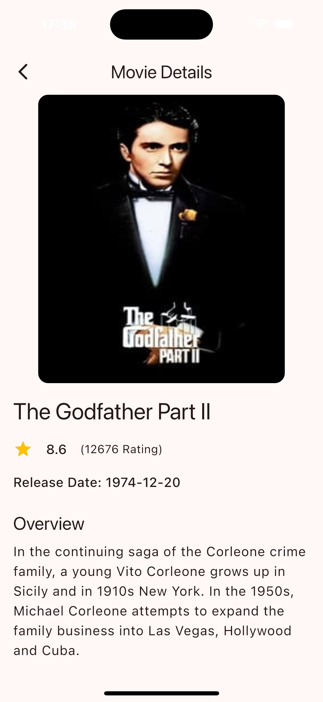

# Movie App 🎥

A Flutter application that displays movies from TMDB (The Movie Database) API, featuring trending movies, search functionality, and favorite movie management.

## Features ✅

- **Trending Movies**: Display a list of top-rated movies from TMDB
- **Search**: Search for movies with real-time results
- **Movie Details**: View detailed information about selected movies
- **Favorites**: Add/remove movies to/from favorites (stored locally)
- **Clean Architecture**: Follows clean architecture principles for maintainable code
- **Responsive UI**: Beautiful and responsive UI with Material Design 3
- **Animations**: Smooth animations and transitions for better user experience

## Screenshots 📱

<div align="center">
 <table>
  <tr>
    <td align="center">
      
      <br><em>Home View</em>
    </td>
    <td align="center">
      
      <br><em>Home View (Search Movie)</em>
    </td>
  </tr>
  <tr>
    <td align="center">
      
      <br><em>Favorites View</em>
    </td>
    <td align="center">
      
      <br><em>Movie Detail View</em>
  </tr>
</table>
</div>

## Architecture 🗒️

The project follows Clean Architecture principles and is organized as follows:

```
lib/
├── core/
│   ├── base/
│   │   ├── model/
│   │   ├── view/
│   │   └── viewModel/
│   ├── constants/
│   ├── init/
│   │   ├── cache/
│   │   ├── navigation/
│   │   └── network/
│   ├── models/
│   ├── service/
│   └── utils/
└── feature/
    ├── home/
    ├── favorites/
    └── movieDetail/
```

### Key Components 🔐

- **Core**: Contains base classes, constants, and utilities
- **Feature**: Contains feature-specific implementations
- **Services**: Handles API communication
- **ViewModels**: Manages business logic and state
- **Views**: Handles UI representation
- **Models**: Defines data structures

## Technologies & Libraries 🌎

- **State Management**: Provider
- **Network**: Dio
- **Local Storage**: Hive
- **Image Caching**: Cached Network Image
- **JSON Handling**: JSON Serializable
- **Code Quality**: Very Good Analysis

## Getting Started 👋🏻

1. Clone the repository:
```bash
git clone https://github.com/yourusername/movie_app.git
```

2. Get dependencies:
```bash
flutter pub get
```

3. Run the app:
```bash
flutter run
```

## API Configuration 🛜

The app uses TMDB API. You need to:
1. Get an API key from [TMDB](https://www.themoviedb.org/documentation/api)
2. Replace the API key in `lib/core/constants/app_constants.dart`

## Code Style 🖍️

The project follows the official Dart style guide and uses additional rules from Very Good Analysis.

## Testing 🪚

To run tests:
```bash
flutter test
```

## Contributing 😌

1. Fork the repository
2. Create your feature branch
3. Commit your changes
4. Push to the branch
5. Create a Pull Request

## License ☑️

This project is licensed under the MIT License - see the [LICENSE](LICENSE) file for details.
